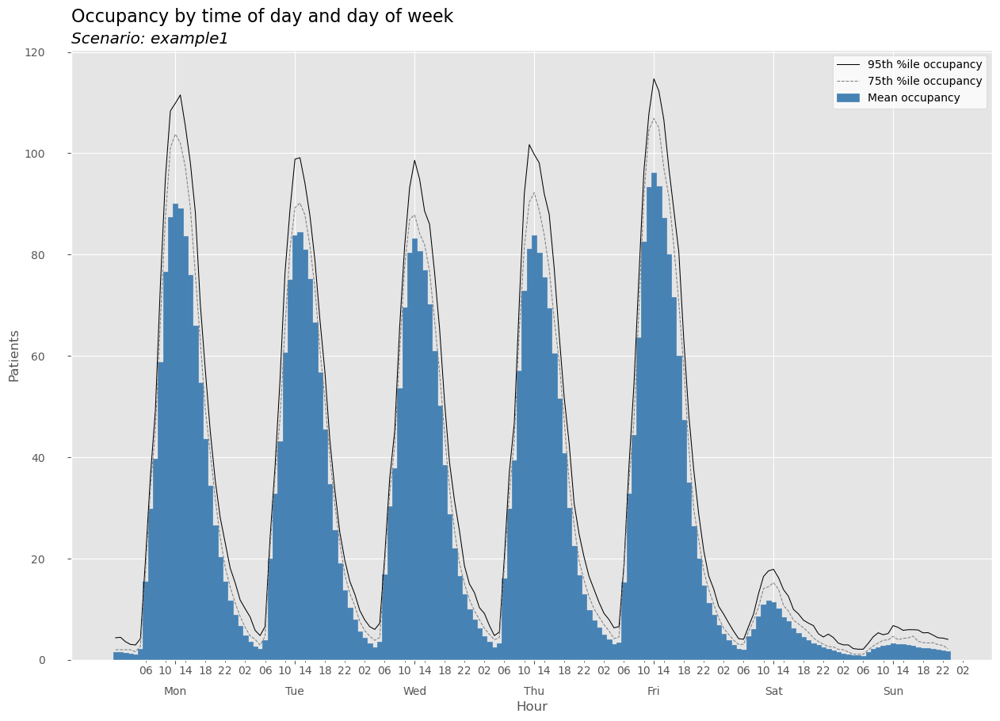

# Summary

hillmaker is a Python package that computes time of day and day of week specific arrival, departure, and 
occupancy statistics from 
transaction data containing arrival and departure timestamps. Typical use is for capacity planning problems in 
places like hospital emergency departments, surgical recovery rooms or any system in which entities arrive, 
occupy capacity for some amount of time, and then depart. It gets its name from the hill-like nature of 
summary occupancy plots - see \autoref{fig:occplot}.

The hillmaker package can be used as a command line application as well as an importable library from Jupyter notebooks
or Python scripts. There is an object-oriented API
as well as a function based API. Under the hood, hillmaker relies primarily on numpy [@harris2020array], pandas [@reback2020pandas], 
matplotlib [@Hunter:2007], seaborn [@Waskom2021] and [PyDantic](https://docs.pydantic.dev/latest/).
Transaction data can be in CSV format or a pandas `DataFrame`. The primary outputs of hillmaker are:

- pandas `DataFrame`s and CSV files with arrival, departure and occupancy summaries by time of day, day of week and, optionally, a category.
- customizable weekly and daily plots of arrivals, departures and occupancy by time of day and day of week.
- summary tables and plots for length of stay and implied operating hours.
- 
The [documentation](https://hillmaker.readthedocs.io/en/latest/intro.html) includes several tutorials on using hillmaker for typical occupancy analysis problems in healthcare.

# Statement of need

The original motivation for hillmaker was a series of capacity planning problems faced by a management 
engineering group at a large healthcare system. Such
problems are characterized by patient flow and capacity
use that exhibit significant and important time of day and day of week patterns. A huge component of hospital costs 
are related to labor. Staff sizing and scheduling relies on effectively matching capacity to demand that varies significantly by time of day and day of week. Another motivating problem
involved developing a surgical patient rerouting plan to temporarily accommodate patients while a post-surgical holding area
renovation project was underway.  Proper statistical
analysis of patient arrival, departure and occupancy patterns are a critical part of such analyses.

Early versions of hillmaker were used in hundreds of projects in multiple healthcare engineering departments and consulting firms. It
was written in [Microsoft Access](https://www.microsoft.com/en-us/microsoft-365/access) and released as an open source project in the early 2000's. You can still find it
on SourceForge at [https://sourceforge.net/projects/hillmaker/](https://sourceforge.net/projects/hillmaker/). An
academic paper about this early version was published in 2002 [@isken2002modeling] after the first author left industry
and joined Oakland University. Unfortunately, development on this version languished for a variety of
technical and logistical reasons. So, hillmaker continued to get significant use but no improvements were made.

In addition to industry use, hillmaker is well suited for healthcare operations research projects involved patient 
[@broyles2010statistical; @isken2011open; @helm2014design; @konrad2012using], material [@isken2002simulation],
and even information flow [@konrad2008characterizing]. Discrete event
simulation is widely used in such projects and hillmaker can aid in the statistical analysis needed for modeling
entity arrival patterns and for analyzing and validating simulation output. While problems in the healthcare industry spurred 
the development of hillmaker, it has been used in other domains such as [bike share systems](https://bitsofanalytics.org/posts/basic-usage-cycleshare/basic_usage_cycleshare),
freight operations [@castrellon2023enabling], customer contact centers and even for analyzing usage patterns of a high performance computing cluster by engineers at a large automobile manufacturer. 
Any system for which you have data on start and stop times of events or entry and exit times of entities is 
amenable to using hillmaker for characterizing temporal patterns in arrivals, departures and occupancy (or work in progress).

Given the rise of Python
in the scientific computing world, rewriting hillmaker in Python made a lot of sense for its future as an open source
project. The first Python version was [released on GitHub](https://github.com/misken/hillmaker/) in 2016. A series of
improvements followed over the next several years, culminating in the recent release of version 0.8.0 in November
of 2023. Many of the recent improvements were motivated by the second author's use of hillmaker at the UNC Rex 
healthcare system. They used hillmaker to better understand patient throughput and capacity management in their surgical services division as
well as to determine the optimal bed size for a potential same day recovery unit.

By creating an easy to use Python version with extensive documentation, we are hoping that hillmaker can gain 
greater traction now that Python has become so widely used in the data analysis community.
Our plan is to add a form-based GUI (much like the one in the original MS Access version) in the next 
release which should make it even easier to use for non-programmers.

# Acknowledgements

We acknowledge contributions from the many analysts and healthcare institutions for both their direct and
indirect support of the ongoing evolution of hillmaker over the past three decades.  

# References